# CraftyBay

Welcome to the CraftyBay repository! CraftyBay is your go-to e-commerce app, designed to offer you a fantastic shopping experience. With a variety of features like product categorization, product reviews, and a seamless shopping cart, CraftyBay makes shopping a breeze.

## Table of Contents
- [Features](#features)
- [Installation](#installation)
- [Usage](#usage)
- [Screenshots](#screenshots)
- [APK Download](#apk-download)
- [App Video](#app-video)

## Features
- **Product Categories**: Browse and shop for products across various categories.

- **Product Details**: View detailed information about a product, including images, description, price, and reviews.

- **Wishlist**: Add products to your wishlist for future reference. Only registered users can use this feature.

- **Shopping Cart**: Add products to your shopping cart, adjust quantities, and view the total price.

- **Product Reviews and Ratings**: Leave reviews and ratings for products you've purchased.

- **Secure Authentication**: Secure user registration and authentication process. Email verification is required.

- **Profile Completion**: Users need to complete their profile by providing their name and shipping address to use certain features.

- **Checkout**: Purchase products by proceeding to the checkout screen. Choose from various payment options like credit card, bank transfer, and mobile banking.

- **Purchase History**: View your product purchase history to track past orders and keep records of your transactions.

- **Cart Order Adjustment**: Easily increase or decrease the quantity of items in your shopping cart to customize your order.

## Installation
1. Clone this repository: `git clone https://github.com/hossain-eee/Project-Flutter-CraftyBay.git`
2. Change to the project directory: `cd ecommerce-app`
3. Install dependencies: `flutter pub get`
4. Run the app: `flutter run`

## Usage
1. Register and log in to access the full range of features.
2. Explore product categories and view product details.
3. Add products to your wishlist or shopping cart.
4. Leave reviews and ratings for products you've purchased.
5. Complete your profile to unlock additional features like posting reviews.
6. Proceed to the checkout screen when you're ready to make a purchase.

## Screenshots
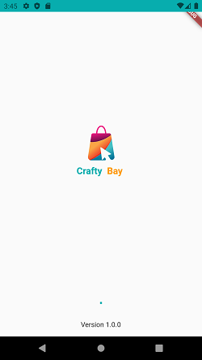
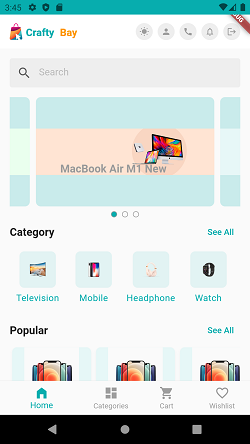
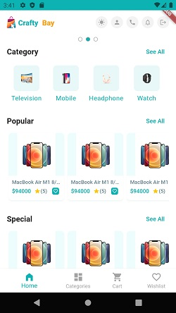
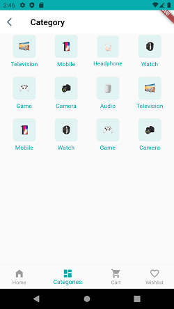
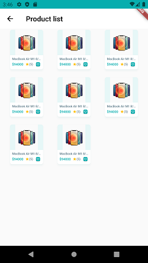
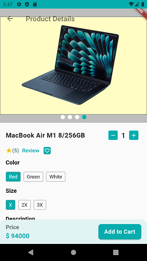
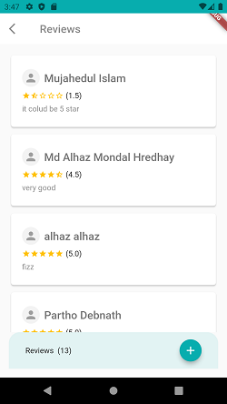
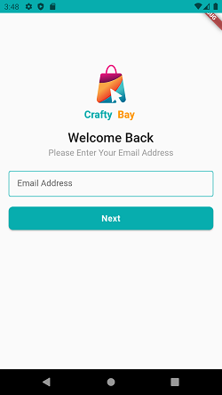
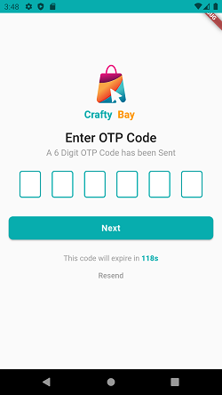
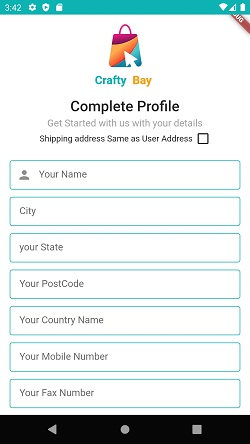
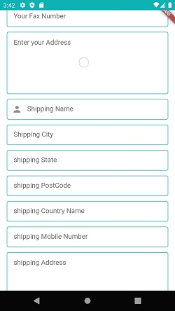
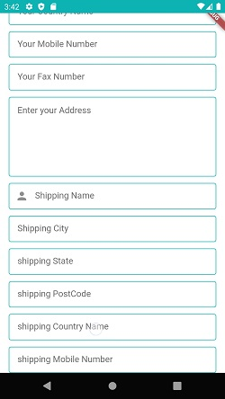
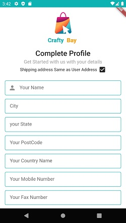
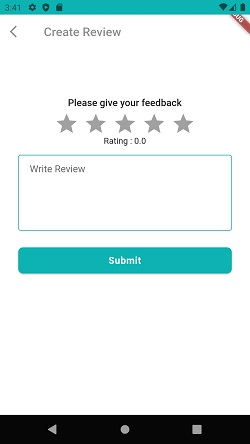
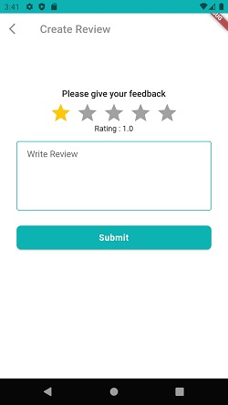
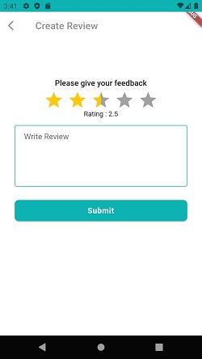
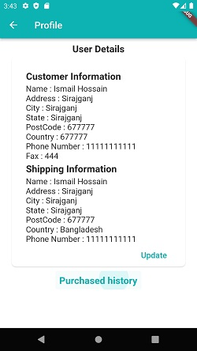
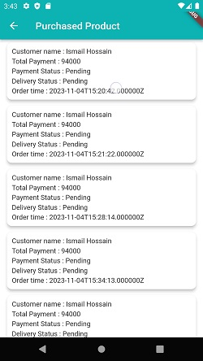
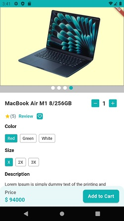
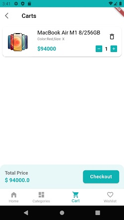
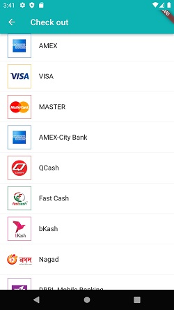
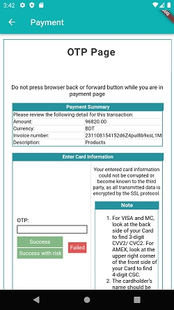
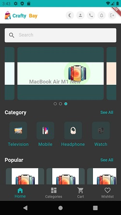
## APK Download

[Download APK](https://drive.google.com/file/d/10PghhHuY2zls7a_Ih_lvQpAJeWISFW2o/view?usp=drive_link)

## App Video

[Watch App Video](https://drive.google.com/file/d/1rD0GYN-bsCTSHW_5al46U5mkDLaGd_j_/view?usp=drive_link)

## Used Packages
This app uses several Flutter packages to enhance its functionality. Below is a list of key packages used and how they are integrated:

- **flutter_svg: ^2.0.7**: Used to display SVG images in the app.

- **get: ^4.6.6**: Utilized for state management and app navigation.

- **pin_code_fields: ^8.0.1**: Implemented for OTP (One-Time Password) input functionality.

- **carousel_slider: ^4.2.1**: Used to create image carousels in the app.

- **http: ^1.1.0**: Utilized for making HTTP requests to retrieve data from remote servers.

- **get_storage: ^2.1.1**: Used for efficient local storage of data, including theme mode (light or dark), improving app performance.

- **shared_preferences: ^2.2.1**: Used for persisting user authentication status, ensuring users remain logged in between app sessions.

- **connectivity_plus: ^5.0.0**: Used to detect the device's network connectivity.

- **webview_flutter: ^4.4.1**: Integrated to display web content within the app.

- **flutter_rating_bar: ^4.0.1**: Implemented to allow users to post product reviews and ratings easily.

## Theme Mode Persistence
This app allows users to switch between light and dark themes. The selected theme mode is persisted using the `get_storage` package, ensuring that users see their preferred theme even after app restarts.

## User Authentication Remember
The app uses the `shared_preferences` package to remember user authentication status. If a user logs in, the app will remember their login status, making it convenient for users to access their accounts without repeated logins.

## Token Expiry and Email Verification
For enhanced security, user authentication is subject to token expiry. Users may need to re-verify their email if their authentication token has expired. This additional layer of security helps protect user accounts and sensitive data.

### E-Commerce Project Structure

The E-Commerce app follows a structured project architecture that separates various components for easy maintenance and scalability. The project structure is organized into multiple layers, allowing for flexibility and adaptability to changes and improvements. This architecture enhances code readability and maintainability.

**App Layer Structure:**

- **lib/**
  - **application**: This layer contains the application-level code that serves as the entry point for the app. It manages configuration, initial setup, and routing.
  
  - **data**: The data layer is responsible for handling all data-related operations, such as fetching data from various sources (e.g., remote servers, databases). Data source management is kept separate to ensure that the app can seamlessly adapt to changes in data sources (e.g., switching between Firebase and a database) without requiring extensive code modifications. Any changes in data source can be made within this layer, avoiding widespread code adjustments.
  
  - **presentation**: This layer is dedicated to user interface components. It includes screens, widgets, and styles that users interact with.
  
  - **state_holders**: Here, the app uses GetX for state management. Controllers and state management logic are organized within this layer.
  
  - **utility**: This layer houses utilities, such as color definitions and styles that are consistently applied throughout the app.

**App Layer Structure Tree:**

├── lib/
│ ├── application/
│ ├── data/
│ └── presentation/
│ ├── state_holders/
│ └── ui/
│ ├── screens/
│ ├── utility/
│ └── widgets/

This structured approach ensures that the E-Commerce app is organized, easy to maintain, and can seamlessly adapt to changes and improvements in data sources or user interfaces. It promotes code modularity and scalability, making the app more robust and future-proof.
